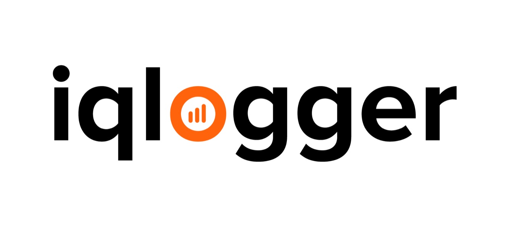

IQ Logger
=======================

[](https://opensource.org/licenses/Apache-2.0)
[](https://travis-ci.com/neogenie/iqlogger)



**IQLogger** - высокопроизводительное легковесное решение для сбора, процессинга, транспорта и балансировки логов из любых источников, включая:

 - логи приложений
 - логи nginx, postgresql и других стандартных приложений
 - системные логи (syslog, journal, dmesg и пр.)
 - логи docker-контейнеров

В качестве источника логов могут быть использованы:

 - файлы (поддерживаются многострочные записи и ротация файлов)
 - TCP/UDP потоки в формате GELF
 - TCP/UDP потоки в формате JSON
 - Системный журнал Systemd (journald) 

Для процессинга логов может быть использован высокопроизводительный JavaScript-процессор на основе V8.

# Быстрый старт

Docker

```
docker run -d neogenie/iqlogger
```

Ubuntu 16.04 / 18.04

```

wget ...

```

# Модули

IQLogger построен по модульной архитектуре. Это позволяет независимо разрабатывать и использовать различные модули для получения, отправки и обработки
сообщений логов в различных форматах. В стандартную поставку включены следующие модули:

## Input - модули

Input - модули предназначены для сбора логов из различных источников.
- gelf (TCP / UDP)
- tail
- journal
- json
- dummy

## Output - модули

Output - модули предназначены для отправки логов в различные приемники, например, Graylog.

- gelf - используется для отправки логов в Graylog
- log - может быть использован для отладки
